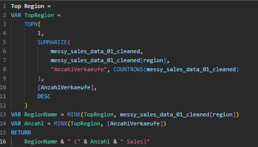
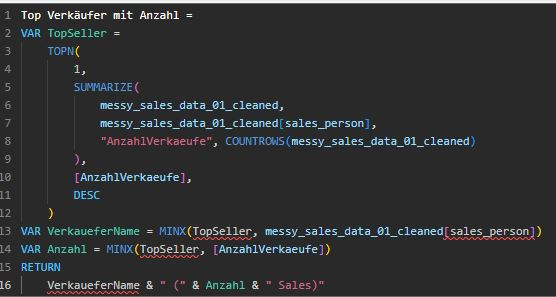
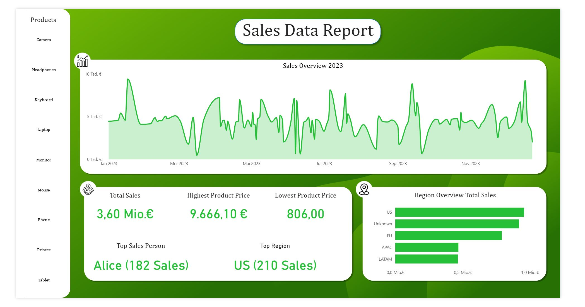

The first look of my cleaned data in looking like 

I changed some datatypes for some columns like prices to USA currencytype and the order_date to date type also the discount into procent, i could have done some of this settings in python but its more comfortable to do that in Power Query in Power BI.

The next steps are to create the vis for my report, i go for a linechart to visualize the total sales and the sales for every product, this step is very easy and mostly design so i didnt make any screenshots and just show you the result at the end.

One step is also to write the DAX Measures for to map vis. 

The meausres will show the region and sales_person with the most sales in total and for every product, this gives a good insight into the best employee and customer (continent).

I also created some vis for the total sales, highest product price, lowest product price and a bar chart for the region of every sale.

Every vis is interactive and will adjust to every product you can see in my datasplit, i also added these nice icons on every category of my vis.

The final result looks like this:

You have a nice insight into the sales of the year 2023, you can compare different products or just see the bilance in total 

In my opionion this report is optimized so everybody can handle the information about this dataset and can perform analysis about the year 2023.
