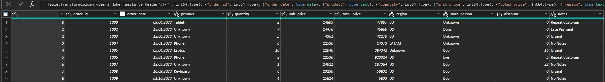
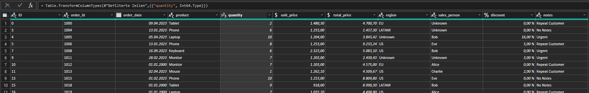

The first look of my cleaned data in looking like 

I changed some datatypes for some columns like prices to USA currencytype and the order_date to date type also the discount into procent, i could have done some of this settings in python but its more comfortable to do that in POwer Query in Power BI.

